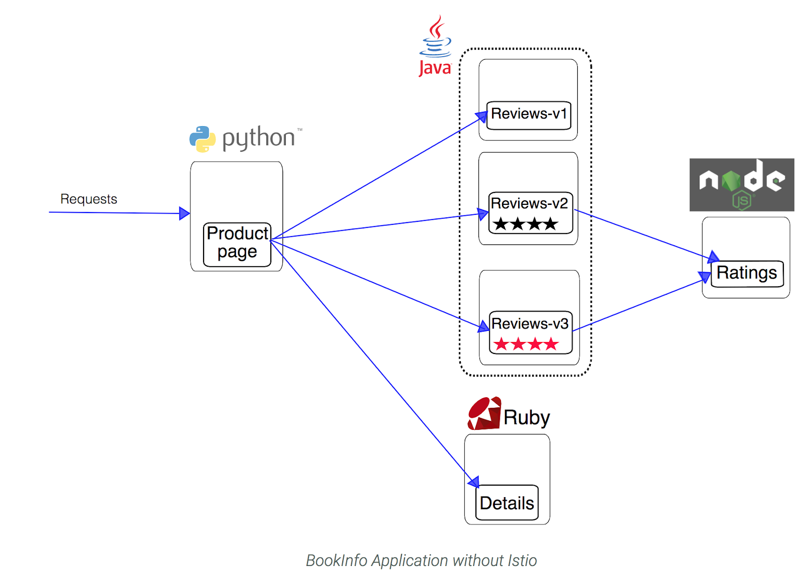

# istio-example
通过bookinfo的例子，可以体验istio的流量管理过程

参考来自[istio/example](https://github.com/istio/istio/tree/master/samples/bookinfo)

### 前提

平台选择k8s，并且已安装istio

### 部署bookinfo应用

#### bookinfo介绍

总共有4个微服务:
- productpage
- details
- reviews
- ratings

其中reviews又存在3个版本
- version v1
- version v2
- version v3

架构如下：


#### 部署过程

bookinfo.yml描述了bookinfo应用的deployment和service，就是简单的k8s对象，没有任何istio相关的东西

首先，在命名空间default（为了方便）开启sidecar自动注入

```
kubectl label namespace default istio-injection=enabled

kubectl get namespace -L istio-injection
```

接下来，部署应用bookinfo

```
kubectl apply -f bookinfo.yml
```

再接下来，为了能访问到bookinfo，即用户可以通过"ingres"进入到网格中，我们需要创建一个`gateway`

```
kubectl apply -f bookinfo-gateway.yml
```

至此，应用部署完成

### 访问应用

首先，获取`gateway`的`external IP`

```
kubectl get svc istio-ingressgateway -n istio-system

# 显示
NAME                   TYPE           CLUSTER-IP      EXTERNAL-IP      PORT(S)                                                                                                                   AGE
istio-ingressgateway   LoadBalancer   10.39.245.229   35.221.131.137   80:31380/TCP,443:31390/TCP,31400:31400/TCP,15011:31314/TCP,8060:30706/TCP,853:30684/TCP,15030:32002/TCP,15031:32463/TCP   14d

```

接下来，浏览器输入`http://EXTERNAL-IP/productpage`访问即可


### 其他实例

- static-routing
- dynamic-routing
- fault-injection
- weight-based
- policy
